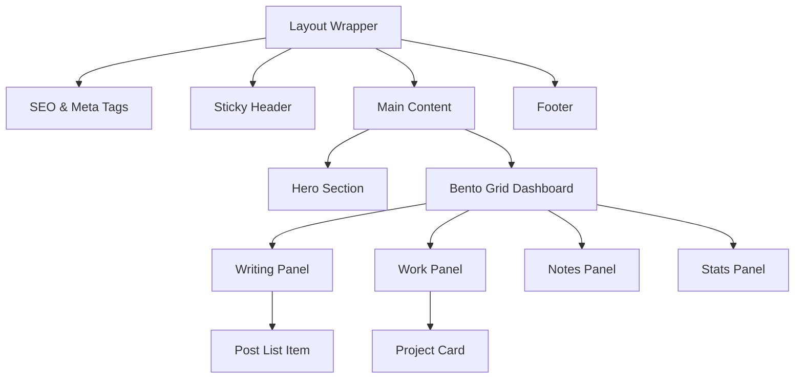

import Callout from '@/components/Callout.astro'

## Filosofi: Lebih dari Sekadar Kartu Nama

Di era internet saat ini, banyak developer memiliki website portofolio yang statis—hanya sekadar CV yang ditempel di web. Saya menginginkan sesuatu yang berbeda. Saya ingin membangun sebuah **"Digital Garden"** (Taman Digital) atau lebih tepatnya, sebuah **Command Center**.

Website ini bukan hanya tempat memajang karya, tapi juga tempat saya mencatat ide, bereksperimen dengan kode, dan membagikan apa yang saya pelajari sehari-hari.

<Callout type="info" title="Konsep Utama">
  Tujuan utamanya adalah menciptakan antarmuka yang **padat informasi** namun tetap **estetik**, seperti panel kendali di film sci-fi retro, di mana semua fungsi penting bisa diakses dalam sekali lihat.
</Callout>


## Desain: Estetika "Command Center"

Mengapa memilih tampilan gelap dengan aksen *yellow* (kuning industrial) dan font *monospace* (seperti mesin ketik)?

1.  **Fokus pada Konten:** Seperti terminal komputer, tidak ada dekorasi berlebihan. Yang ada hanya data dan teks.
2.  **Kenyamanan Mata:** Mode gelap (*Dark Mode*) adalah standar industri bagi developer yang menatap layar berjam-jam.
3.  **Identitas:** Memberikan kesan *hacker-ish* dan teknikal, mencerminkan profesi saya sebagai engineer.

## Dapur Pacu: Mengapa Astro?

Untuk orang awam, bayangkan membuat website itu seperti membangun rumah.

*   **Cara Lama (WordPress/Wix):** Seperti menyewa apartemen furnished. Cepat, tapi sulit diubah sesuka hati dan kadang "berat" karena banyak perabot yang tidak kita butuhkan.
*   **Cara Modern (React/SPA):** Seperti membangun rumah dari nol, tapi pengunjung harus menunggu tukang merakit rumahnya setiap kali mereka berkunjung (loading time).
*   **Cara Saya (Astro):** Astro bekerja seperti pabrik pre-fabrikasi. Rumahnya sudah dirakit penuh di "pabrik" (server saya). Ketika Anda berkunjung, rumahnya sudah jadi.

### Arsitektur Website (Component Tree)

Berikut adalah struktur bagaimana halaman depan (Dashboard) disusun dari komponen-komponen kecil:



**Hasilnya?** Website ini sangat cepat. Klik halaman mana saja, dan isinya muncul hampir seketika.

<Callout type="warning" title="Untuk yang Teknis">
  Project ini menggunakan **Astro v5** dengan **Tailwind CSS v4**. Saya menggunakan arsitektur *Island Architecture*, di mana mayoritas halaman adalah HTML statis (ringan), dan JavaScript hanya dikirimkan untuk bagian yang interaktif saja (seperti tombol tema atau search bar).
</Callout>

## Struktur Konten: Otak di Balik Layar

Salah satu tantangan terbesar developer adalah mengatur dokumentasi. Di sini, saya membagi "isi otak" saya menjadi beberapa laci:

1.  **Writing:** Artikel mendalam dan tutorial.
2.  **Notes:** Catatan teknis pendek (snippets).
3.  **Library & Gallery:** Koleksi buku dan inspirasi visual.

## Tantangan Pengembangan

Mengubah template standar menjadi desain *custom* seperti ini tidak mudah. Tantangan terbesarnya adalah **Konsistensi Desain**.

Saya harus memastikan bahwa elemen desain (seperti efek *vignette* di pinggir layar atau garis-garis grid di latar belakang) terlihat konsisten di layar HP kecil maupun monitor besar. Saya menggunakan **Tailwind CSS** untuk mempercepat proses "melukis" desain ini langsung di kode.

```css
/* Contoh kode untuk membuat efek latar belakang kotak-kotak */
body {
  background-image: 
    linear-gradient(to right, rgba(0,0,0,0.05) 1px, transparent 1px),
    linear-gradient(to bottom, rgba(0,0,0,0.05) 1px, transparent 1px);
  background-size: 40px 40px;
}
```

## Kesimpulan

**Alvito.dev** bukan sekadar website portofolio statis, melainkan sebuah sistem operasi personal yang hidup di internet. Ia akan terus berkembang seiring bertambahnya skill dan pengalaman saya.

Silakan jelajahi "laci-laci" lainnya di website ini!
